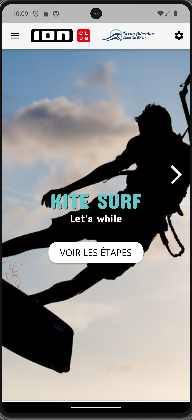
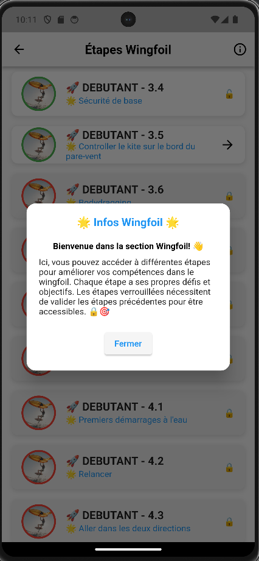
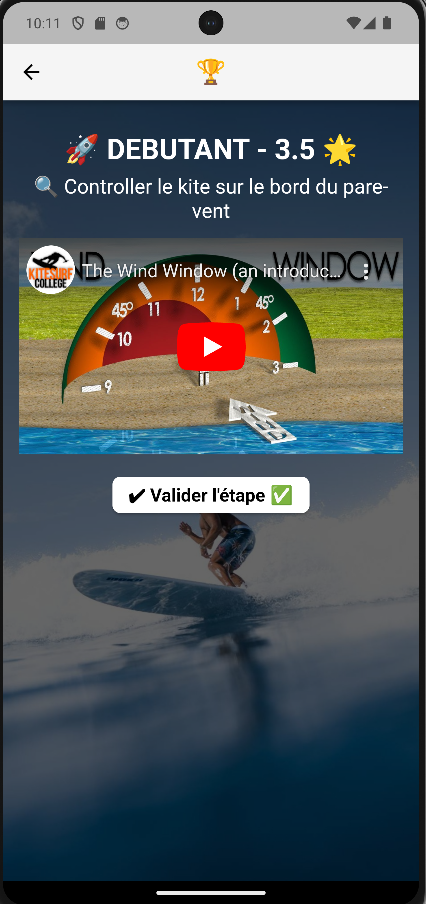
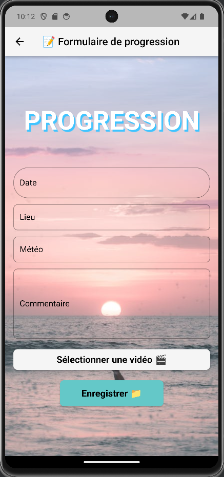

# notebook_progress
_Description
Cette application mobile est un cahier de progression pour les sports de kitesurf, wing foil et surf. Vidéos incluses pour améliorer la technique. Saisie de notes de progression dans une feuille de notes par niveaux.

Capture d'ecrans_

_Technologies Utilisées
Langage de Programmation : Dart
Framework : Flutter
Base de Données : Firebase

Auteurs
KOFFI jean-jonathan - Développeur junior alternant - https://www.linkedin.com/in/n%E2%80%99dri-jean-jonathan-koffi-b54b1a216/_

## Getting Started

This project is a starting point for a Flutter application.

A few resources to get you started if this is your first Flutter project:

- [Lab: Write your first Flutter app](https://docs.flutter.dev/get-started/codelab)
- [Cookbook: Useful Flutter samples](https://docs.flutter.dev/cookbook)

For help getting started with Flutter development, view the
[online documentation](https://docs.flutter.dev/), which offers tutorials,
samples, guidance on mobile development, and a full API reference.
